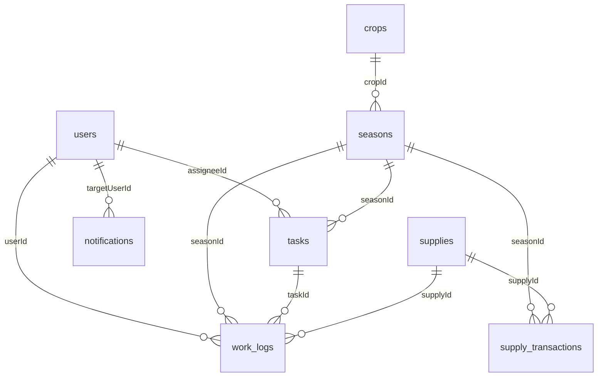

# 🗄️ Cấu trúc Database

Hệ thống sử dụng **MySQL** với **Drizzle ORM**. Schema được định nghĩa tại `shared/schema.ts`.

## Sơ đồ quan hệ



## Bảng dữ liệu

### `users` — Người dùng

| Cột | Kiểu | Mô tả |
|-----|------|-------|
| `id` | VARCHAR(36) PK | UUID |
| `username` | TEXT | Tên đăng nhập |
| `password` | TEXT | Mật khẩu |
| `full_name` | TEXT | Họ tên |
| `role` | ENUM(manager, farmer) | Vai trò |
| `phone` | TEXT | Số điện thoại |
| `avatar` | TEXT | Ảnh đại diện |
| `is_locked` | BOOLEAN | Khóa tài khoản |

### `crops` — Cây trồng

| Cột | Kiểu | Mô tả |
|-----|------|-------|
| `id` | VARCHAR(36) PK | UUID |
| `name` | TEXT | Tên cây trồng |
| `variety` | TEXT | Giống |
| `description` | TEXT | Mô tả |
| `growth_duration` | INT | Thời gian sinh trưởng (ngày) |
| `optimal_temp` | TEXT | Nhiệt độ tối ưu |
| `optimal_humidity` | TEXT | Độ ẩm tối ưu |
| `optimal_ph` | TEXT | pH tối ưu |
| `care_instructions` | TEXT | Hướng dẫn chăm sóc |
| `image` | TEXT | Ảnh |

### `seasons` — Mùa vụ

| Cột | Kiểu | Mô tả |
|-----|------|-------|
| `id` | VARCHAR(36) PK | UUID |
| `name` | TEXT | Tên mùa vụ |
| `crop_id` | VARCHAR(36) FK | Cây trồng |
| `status` | ENUM(planning, active, completed) | Trạng thái |
| `current_stage` | ENUM(preparation, planting, caring, harvesting) | Giai đoạn hiện tại |
| `start_date` | DATE | Ngày bắt đầu |
| `end_date` | DATE | Ngày kết thúc |
| `area` | FLOAT | Diện tích |
| `area_unit` | TEXT | Đơn vị (default: ha) |
| `notes` | TEXT | Ghi chú |
| `progress` | INT | Tiến độ (%) |
| `estimated_yield` | FLOAT | Sản lượng ước tính |
| `cultivation_zone` | TEXT | Vùng canh tác |

### `tasks` — Công việc

| Cột | Kiểu | Mô tả |
|-----|------|-------|
| `id` | VARCHAR(36) PK | UUID |
| `title` | TEXT | Tiêu đề |
| `description` | TEXT | Mô tả |
| `season_id` | VARCHAR(36) FK | Mùa vụ |
| `assignee_id` | VARCHAR(36) FK | Người được giao |
| `status` | ENUM(todo, doing, done, overdue) | Trạng thái |
| `priority` | ENUM(low, medium, high) | Mức ưu tiên |
| `stage` | ENUM(preparation, planting, caring, harvesting) | Giai đoạn |
| `due_date` | DATE | Hạn hoàn thành |
| `completed_at` | TIMESTAMP | Thời gian hoàn thành |
| `created_at` | TIMESTAMP | Thời gian tạo |
| `proof_image` | TEXT | Ảnh minh chứng |
| `harvest_yield` | FLOAT | Sản lượng thu hoạch |

### `work_logs` — Nhật ký công việc

| Cột | Kiểu | Mô tả |
|-----|------|-------|
| `id` | VARCHAR(36) PK | UUID |
| `task_id` | VARCHAR(36) FK | Công việc |
| `season_id` | VARCHAR(36) FK | Mùa vụ |
| `user_id` | VARCHAR(36) FK | Người thực hiện |
| `content` | TEXT | Nội dung |
| `hours_worked` | FLOAT | Số giờ làm |
| `created_at` | TIMESTAMP | Thời gian tạo |
| `supply_id` | VARCHAR(36) FK | Vật tư sử dụng |
| `supply_quantity` | FLOAT | Số lượng vật tư |

### `supplies` — Vật tư

| Cột | Kiểu | Mô tả |
|-----|------|-------|
| `id` | VARCHAR(36) PK | UUID |
| `name` | TEXT | Tên vật tư |
| `category` | TEXT | Danh mục |
| `unit` | TEXT | Đơn vị |
| `current_stock` | FLOAT | Tồn kho |
| `min_threshold` | FLOAT | Ngưỡng cảnh báo |
| `status` | ENUM(ok, low, out) | Trạng thái kho |

### `supply_transactions` — Giao dịch vật tư

| Cột | Kiểu | Mô tả |
|-----|------|-------|
| `id` | VARCHAR(36) PK | UUID |
| `supply_id` | VARCHAR(36) FK | Vật tư |
| `season_id` | VARCHAR(36) FK | Mùa vụ |
| `type` | TEXT | Loại (import/export) |
| `quantity` | FLOAT | Số lượng |
| `note` | TEXT | Ghi chú |
| `created_at` | TIMESTAMP | Thời gian |

### `climate_readings` — Dữ liệu khí hậu

| Cột | Kiểu | Mô tả |
|-----|------|-------|
| `id` | VARCHAR(36) PK | UUID |
| `temperature` | FLOAT | Nhiệt độ (°C) |
| `humidity` | FLOAT | Độ ẩm (%) |
| `rainfall` | FLOAT | Lượng mưa (mm) |
| `light_intensity` | FLOAT | Cường độ sáng |
| `soil_moisture` | FLOAT | Độ ẩm đất |
| `soil_ph` | FLOAT | pH đất |
| `wind_speed` | FLOAT | Tốc độ gió (km/h) |
| `location` | VARCHAR(100) | Vị trí |
| `recorded_at` | TIMESTAMP | Thời gian ghi nhận |

### `alerts` — Cảnh báo

| Cột | Kiểu | Mô tả |
|-----|------|-------|
| `id` | VARCHAR(36) PK | UUID |
| `type` | ENUM(low_stock, overdue_task, weather, stage_change) | Loại |
| `severity` | ENUM(info, warning, critical) | Mức độ |
| `title` | TEXT | Tiêu đề |
| `message` | TEXT | Nội dung |
| `is_read` | BOOLEAN | Đã đọc |
| `related_id` | VARCHAR(36) | ID liên quan |
| `created_at` | TIMESTAMP | Thời gian |

### `notifications` — Thông báo cá nhân

| Cột | Kiểu | Mô tả |
|-----|------|-------|
| `id` | VARCHAR(36) PK | UUID |
| `target_user_id` | VARCHAR(36) FK | Người nhận |
| `title` | TEXT | Tiêu đề |
| `message` | TEXT | Nội dung |
| `is_read` | BOOLEAN | Đã đọc |
| `related_id` | VARCHAR(36) | ID liên quan |
| `created_at` | TIMESTAMP | Thời gian |

## Lệnh quản lý database

```bash
# Đồng bộ schema lên database
npx drizzle-kit push --force

# Tạo migration
npx drizzle-kit generate

# Xem database trên trình duyệt
npx drizzle-kit studio
```
